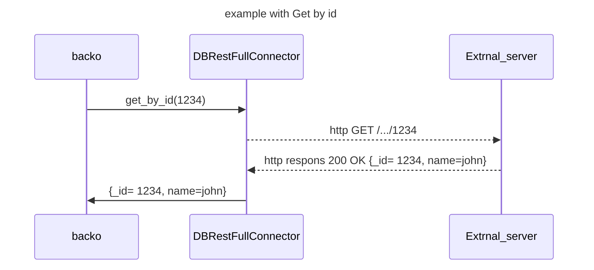
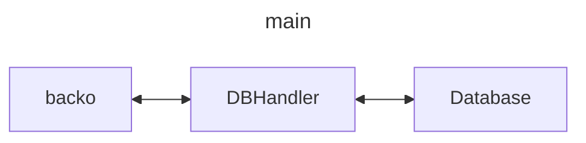

# Database Management

Backo can connect to different databases. Il use some {py:class}`DBHandler <backo.db.DBHandler>` for that.

**Each {py:class}`Collection <backo.Collection>` has its own {py:class}`DBHandler <backo.db.DBHandler>`.**


## DBHandlers out of the box.

Backo comes with some available DBHandlers :

* {std:ref}`DBYmlConnector` For store the collection somewhere in a yml file.
* {std:ref}`DBYmlDirConnector` For store the collection a directory (one file per item).
* {std:ref}`DBMongoConnector` For store the collection a mongoDB database.
* {std:ref}`DBRestFullConnector` To address a Database via a a restfull API
* {std:ref}`DBsqlite3Connector` For store the collection a SQLite3 database.
* {std:ref}`DBValkeyConnector` For store the collection a ValKey (Redis) memory database.


## Available Connectors

(DBYmlConnector)=
### DBYmlConnector

This DBHandler is used to store data of the collection in  a single yaml file. 

```python
from backo.db import DBYmlConnector

yml_db_connector = DBYmlConnector("/tmp/my_yaml_file.yml")
# Will store datas in "/tmp/my_yaml_file.yml" and the result will be like :
# { "_id1" : {  "name" : "Alfred" }, "_id2" : { "name" : "Bates" } }

```

You can specify a sub path to store data with `db_path=list[ str ]`
```python
from backo.db import DBYmlConnector

yml_db_connector = DBYmlConnector("/tmp/my_yaml_file.yml", db_path=[ "in", "forest" ] )
# Will store datas in "/tmp/my_yaml_file.yml" and the result will be like :
# { "in" : { "forest" : { "_id1" : {  "name" : "Alfred" }, "_id2" : { "name" : "Bates" }}}, "other_key" : "whatyouwant" }

```

You can store also as array with `by_id=False`

```python
from backo.db import DBYmlConnector

yml_db_connector = DBYmlConnector("/tmp/my_yaml_file.yml", db_path=[ "in", "forest" ], by_id=False)
# Will store datas in "/tmp/my_yaml_file.yml" and the result will be like :
# { "in" : { "forest" : [ { _id : "_id1", "name" : "Alfred" }, { "_id": "_id2", "name" : "Bates" }] } , "other_key" : "whatyouwant" }

```

```{warning}
This DBHandler doesn't handle SFilter during selections. Accordingly, the filtering is done by backo itself.
```

```{seealso}
{py:class}`DBYmlConnector <backo.db.DBYmlConnector>` for more details.
```


(DBYmlDirConnector)=
### DBYmlDirConnector 

This DBHandler is used to store data in yaml files, all in the same directory. 

```python
from backo.db import DBYmlDirConnector

yml_db_connector = DBYmlDirConnector("/tmp/my_dir")

# You can rewrite the fonction to generate the _id to have understandable _ids.
yml_db_connector.generate_id = lambda o: f"User_{o["name"]}_{o["surname"]}"
```

```{warning}
This DBHandler doesn't handle SFilter during selections. Accordingly, the filtering is done by backo itself.
```

```{seealso}
 {py:class}`DBYmlDirConnector <backo.db.DBYmlDirConnector>` for more details.
```


(DBMongoConnector)=
### DBMongoConnector

This handler is used to store the collection in a mongo collection.

```python
from backo.db import DBMongoConnector

mongo_db_connector = DBMongoConnector("mongodb://localhost:27017/testMongo", "MyColl")

```

During a select, SFilter from backo are automaticaly translated in mongo filters. So the select is direclty done by the database

```{seealso}
 {py:class}`DBMongoConnector <backo.db.DBMongoConnector>` for more details.
```


(DBSqlite3Connector)=
### DBSqlite3Connector

Sqlite3 connector is available. You have to define tables, pragma according to the backo structure of the collection. For that
the DBConnector can help you with the command {py:meth}`backo.db.DBHandler.check_structure`

```python
from backo.db import DBSqlite3Connector

connector = DBSqlite3Connector("/tmp/store.db")

# You can check 
( struct_valid , message ) = connector.check_structure()
# struct_valid is False  if you have to alter / create tables. message return sql operations to do a strings

# Make the tables compliant with backo (dangerous)
connector.check_structure(True)

```
During a select, SFilter from backo are automaticaly translated in sqlite3 filter. So the select is direclty done by the database


```{seealso}
 {py:class}`DBSqlite3Connector <backo.db.DBSqlite3Connector>` for more details.
```


(DBRestFullConnector)=
### DBRestFullConnector


The DBRestFullConnector is a special DBHandler. It shows data from an external API as a internal Collection.



The DBRestFullConnector cannot be used direclty, it mus be adapt to the API scheme. for each call.


```{tip}
This DBHandler must probably be completed with some {std:ref}`Transformer` to adapt responses to the backo model.
```


(DBValkeyConnector)=
### DBValkeyConnector

ValKey or Redis connector. Use to store Datas in memory un key-value system.


```python
from backo.db import DBValkeyConnector

conector = DBValkeyConnector("Redis", "redis://localhost:6379/0")

```

```{seealso}
 {py:class}`DBValkeyConnector <backo.db.DBValkeyConnector>` for more details.
```


```{warning}
This DBHandler doesn't handle SFilter during selections. Accordingly, the filtering is done by backo itself.
```


(Transformer)=
## Adapt Backo to an existing Database


We can imagine the database doesn't complain exactly to the backo structure you need. You have to do some changements of keys in the object, ignore some, etc...
You can do that be using one or more {py:class}`db.Transformer`, in every DBHandlers.

Actually, there is the following transformers :

### Rename Transformer

This {py:class}`db.RenameTransformer` is used to change a value in the DB into a backo.

For example :

```python
from backo.db import DBSqlite3Connector

connector = DBSqlite3Connector("/tmp/store.db")

# Change then $.age in backo structure into $.years and vice versa
conector.register_transformer(RenameTransformer(["age"], ["years"]))

```

```{tip}
During Selections, a selection with `$.age` will be transformed by filter into a ` WHERE years ...`  (for a this sqlite3 example)
```


### Ignore Transformer

This {py:class}`db.IgnoreTransformer` is used to drop some values from the database.


For example :

```python
from backo.db import DBValkeyConnector

conector = DBValkeyConnector("Redis", "redis://localhost:6379/0")

# The database contain $.salary.bonus but we don't want it in the backo definition
conector.register_transformer(IgnoreTransformer(["salary", "bonus"]))

```

### Write your own Transformer

You can write your own Transformer. 

```{seealso}
 {py:class}`db.Transformer` for mor details.
```


## Build your own DBConnector

### How it works.

DBHandlers is the middleware between `backo` and the data storage. It not use backo object and structure, but its own.
Some pointers :



The main functions to fill in your DBHandler is :

* {py:meth}`backo.db.DBHandler.create`  To create an new object in the database
* {py:meth}`backo.db.DBHandler.save`  To save an existing object in the database
* {py:meth}`backo.db.DBHandler.delete`  To delete an existing object in the database
* {py:meth}`backo.db.DBHandler.get_by_id`  To retrieve an object (by its _id) from the database
* {py:meth}`backo.db.DBHandler.select`  To select with a filter a list of object from the database (with pagination, etc...)

The other method mentionned in {py:class}`DBHandler <backo.db.DBHandler>`


Some rules :

* Any `_id` is a `string`
* An object (to create, update) is a `dict`
* path in the object on the backo side are noted `key_path` and are `array of  string`
* path in the object on the database are noted `db_path` and are `array of  string`
* for {py:meth}`backo.db.DBHandler.create`, the object given must be without `_id`. It will be returned
* Errors
  * The {py:meth}`backo.db.DBHandler.delete` must raise an `NotFoundError`  if the `_id` doesnt exists, and return None if everything OK.
  * The {py:meth}`backo.db.DBHandler.get_by_id` must raise an `NotFoundError`  if the `_id` doesnt exists, and return the object (with `id` key filled) if ok.
  * The {py:meth}`backo.db.DBHandler.save` must raise an `NotFoundError`  if the `_id` doesnt exists, and return None if everything OK.
  * Other Errors must be raised as `DBError`
  

